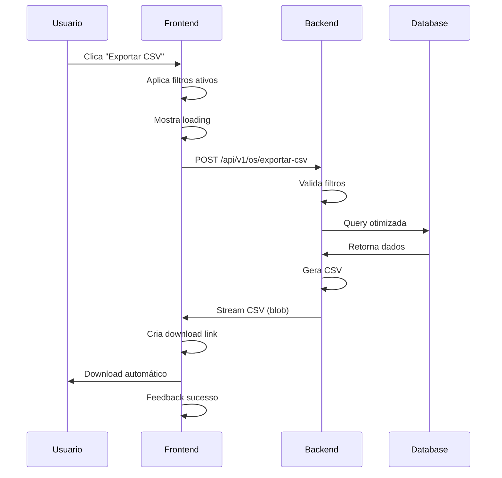

# 🚀 Sistema de Exportação CSV - ICV Brasil

## 📋 Resumo do Projeto

Sistema completo de exportação CSV implementado no projeto ICV Brasil, seguindo a arquitetura DDD (Domain-Driven Design) no backend Laravel e padrões modernos Vue 3 + TypeScript no frontend.

## 🏗️ Arquitetura Implementada

### **Backend (Laravel 11)**
```
app/
├── Http/Controllers/OSController.php     # Endpoint /exportar-csv
├── Http/Requests/ExportarCSVRequest.php  # Validação de filtros
├── Domains/OS/
│   ├── BLL/OSBLL.php                    # Business Logic Layer
│   └── Services/OSService.php           # Service Layer
└── Services/CSVExportService.php        # Serviço compartilhado CSV
```

### **Frontend (Vue 3 + TypeScript)**
```
src/
├── utils/csvUtils.ts                    # Utilitários CSV
├── composables/useCSVExport.ts          # Composable reutilizável
├── pages/inmetro/services/InmetroService.ts  # Serviço HTTP
└── pages/os/store/useOrdemServicoStore.ts    # Store Pinia
```

## ✅ Funcionalidades Implementadas

### **Backend**
- [x] Endpoint RESTful `/api/v1/os/exportar-csv`
- [x] Validação de filtros com `ExportarCSVRequest`
- [x] Arquitetura DDD: Controller → BLL → Service → Model
- [x] Query otimizada com `eager loading`
- [x] Serviço compartilhado para reutilização
- [x] Tratamento de campos nulos
- [x] Resposta como StreamedResponse

### **Frontend**
- [x] Utilitário `CSVUtils` para manipulação de arquivos
- [x] Composable `useCSVExport` para facilitar uso
- [x] Integração com store Pinia
- [x] Feedback visual (loading + snackbar)
- [x] Download automático via blob
- [x] Suporte a BOM (UTF-8)
- [x] Formatação brasileira (datas, moedas)

## 🎯 Endpoints da API

### **POST** `/api/v1/os/exportar-csv`

**Headers:**
```
Accept: text/csv
Content-Type: application/json
Authorization: Bearer {token}
```

**Body (Filtros Opcionais):**
```json
{
  "cliente_id": 123,
  "responsavel_id": 456,
  "data_inicio": "2024-01-01",
  "data_fim": "2024-12-31",
  "tipo_servico_id": 789,
  "escopo_id": 321,
  "fornecedor": "Empresa XYZ",
  "numero_pedido": "PED-2024-001",
  "certificado_associado": "CERT-123",
  "numero_os": "OS-2024-001"
}
```

**Response:**
- **200**: Stream CSV file
- **422**: Validation errors
- **500**: Server error

## 📊 Estrutura do CSV Exportado

```csv
OS;Cliente;Responsável;Data Inspeção;Tipo Serviço;Escopo;Fornecedor;Nº Pedido;Certificado;Valor;Status
OS-2024-001;Cliente ABC;João Silva;01/12/2024;Inspeção Técnica;Equipamentos;Fornecedor XYZ;PED-001;CERT-123;R$ 1.500,00;Finalizada
```

## 🛠️ Como Usar

### **1. No Backend**
```php
// Já implementado - uso direto via API
POST /api/v1/os/exportar-csv
```

### **2. No Frontend (Composable)**
```typescript
import { useCSVExport } from '@/composables/useCSVExport'

const { exportBlobToCSV } = useCSVExport()

// Exportar dados
const blob = await InmetroService.exportarCSV(filtros)
await exportBlobToCSV(blob, { filename: 'relatorios.csv' })
```

### **3. No Frontend (Utilitário)**
```typescript
import { CSVUtils } from '@/utils/csvUtils'

// Download direto de array
CSVUtils.downloadCSVFromArray(data, headers, {
  filename: 'dados.csv',
  separator: ';',
  addBOM: true
})
```

### **4. No Store**
```typescript
// Store já configurado
await store.exportarCSV() // Usa filtros ativos automaticamente
```

## 📁 Arquivos Criados/Modificados

### **Backend**
- ✅ `app/Http/Controllers/OSController.php` - Método `exportarCSV()`
- ✅ `app/Http/Requests/ExportarCSVRequest.php` - Validação
- ✅ `app/Domains/OS/BLL/OSBLL.php` - Método `exportarCSV()`
- ✅ `app/Domains/OS/Services/OSService.php` - Métodos de negócio
- ✅ `app/Services/CSVExportService.php` - Serviço compartilhado
- ✅ `routes/v1/api.php` - Rota POST exportar-csv

### **Frontend**
- ✅ `src/utils/csvUtils.ts` - Classe utilitária
- ✅ `src/composables/useCSVExport.ts` - Composable
- ✅ `src/pages/inmetro/services/InmetroService.ts` - Método API
- ✅ `src/pages/os/store/useOrdemServicoStore.ts` - Integração store

### **Documentação**
- ✅ `docs/EXPORTACAO-CSV-BACKEND.md` - Documentação backend
- ✅ `docs/EXPORTACAO-CSV-FRONTEND.md` - Documentação frontend
- ✅ `docs/ExemploExportacaoCSV.vue` - Exemplo prático
- ✅ `docs/README-EXPORTACAO-CSV.md` - Este arquivo

## 🔧 Configurações

### **Backend (Laravel)**
```php
// config/app.php - Já configurado
'timezone' => 'America/Sao_Paulo',
'locale' => 'pt_BR',
```

### **Frontend (Vue)**
```typescript
// Configurações automáticas via utilitários
const options = {
  separator: ';',        // Separador CSV
  addBOM: true,         // BOM para UTF-8
  encoding: 'UTF-8'     // Codificação
}
```

## 🚦 Estados da Aplicação

### **Loading States**
- `loading.relatorios` - Estado do botão exportar
- `isExporting` - Estado global de exportação

### **Feedback Visual**
- ✅ Snackbar de sucesso
- ❌ Snackbar de erro
- ⏳ Loading no botão
- 🔄 Desabilitação durante processo

## 🧪 Testando a Funcionalidade

### **1. Teste Backend (Postman/Insomnia)**
```bash
POST http://localhost:8000/api/v1/os/exportar-csv
Headers: Accept: text/csv, Authorization: Bearer {token}
Body: {"cliente_id": 1}
```

### **2. Teste Frontend**
1. Abrir página com filtros
2. Aplicar filtros desejados
3. Clicar "Exportar CSV"
4. Verificar download automático
5. Abrir arquivo no Excel/LibreOffice

### **3. Verificações**
- ✅ Download automático funciona
- ✅ Arquivo abre corretamente no Excel
- ✅ Caracteres especiais preservados
- ✅ Filtros aplicados corretamente
- ✅ Feedback visual adequado

## 🎨 Benefícios da Implementação

### **Performance**
- Query otimizada com `eager loading`
- Streaming de resposta (sem carregar em memória)
- Processamento no backend

### **UX/UI**
- Download automático
- Estados de loading claros
- Feedback imediato
- Aplicação automática de filtros

### **Manutenibilidade**
- Código modular e reutilizável
- Tipagem TypeScript completa
- Documentação detalhada
- Padrões consistentes

### **Escalabilidade**
- Serviço compartilhado para outras entidades
- Composable reutilizável
- Filtros flexíveis
- Arquitetura DDD preparada para crescimento

## 🔄 Fluxo Completo



## 🚀 Próximos Passos (Opcional)

- [ ] Cache de exportações frequentes
- [ ] Exportação assíncrona para grandes volumes
- [ ] Múltiplos formatos (XLSX, PDF)
- [ ] Templates customizáveis
- [ ] Histórico de exportações
- [ ] Compressão de arquivos grandes

---

## 📞 Suporte

Para dúvidas ou problemas:
1. Consulte a documentação específica em `/docs/`
2. Verifique os logs do Laravel em `storage/logs/`
3. Use o console do navegador para debug frontend
4. Teste a API isoladamente primeiro

---

**Status:** ✅ **Produção Ready**  
**Versão:** 1.0  
**Última Atualização:** Dezembro 2024  
**Desenvolvedor:** GitHub Copilot  
**Arquitetura:** Laravel 11 + Vue 3 + TypeScript
